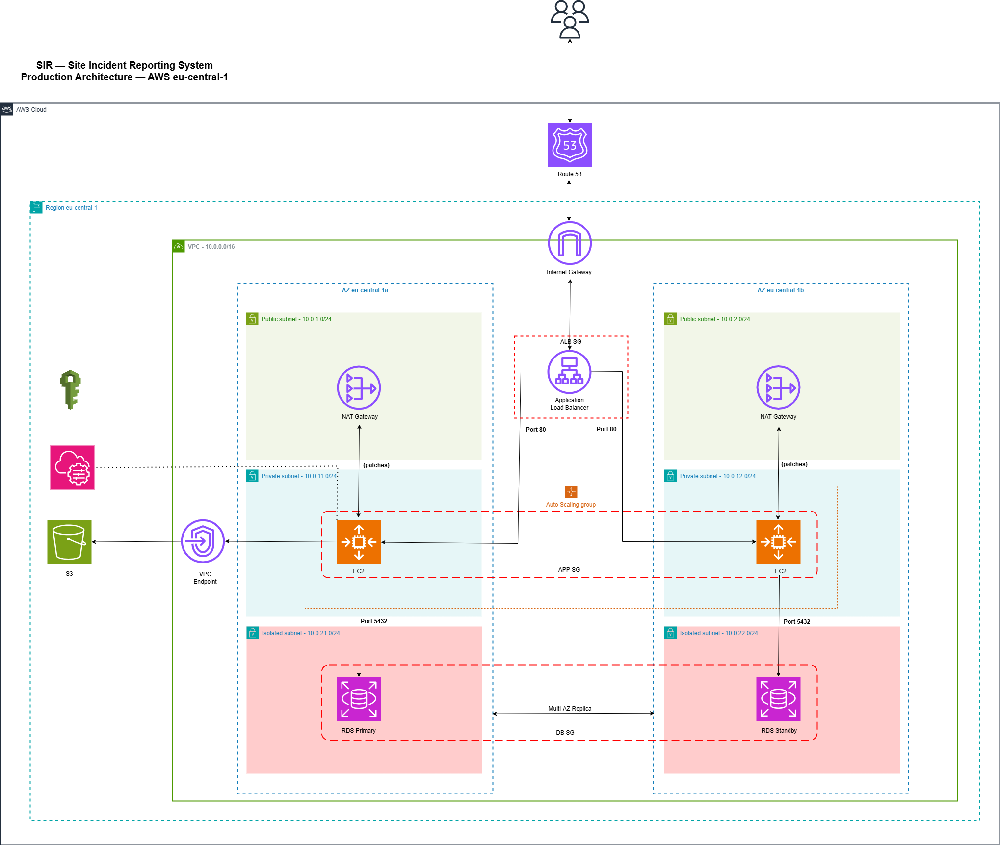

# SIR — Site Incident Reporting System

> Three-tier AWS infrastructure for a web application that centralizes 
> plant safety incidents from global manufacturing sites into a single 
> auditable platform — built with Terraform, documented with Architecture 
> Decision Records.

---

## What This Is

Manufacturing plants across multiple countries generate safety incidents 
daily — equipment faults, near-misses, environmental observations. 
Traditionally these are logged locally, creating fragmented records that 
are difficult to audit and impossible to analyze at scale.

The SIR application provides a centralized web interface where plant 
workers submit incident reports. Quality and safety teams at headquarters 
can review, track, and audit all incidents across every site from a 
single platform.

This repository contains the complete AWS infrastructure for the SIR 
application — designed, documented, and deployed using Terraform.

---

## Architecture



The infrastructure follows a three-tier architecture across two 
Availability Zones in AWS eu-central-1 (Frankfurt):

| Tier | Resources | Purpose |
|---|---|---|
| Public | ALB, NAT Gateway | Internet-facing entry point, outbound patching |
| Private | EC2 (Auto Scaling) | Application logic, nginx web server |
| Isolated | RDS PostgreSQL | Incident data storage, no internet route |

**Supporting services:**
- S3 — incident photo attachment storage
- IAM — least-privilege roles and users
- S3 Gateway VPC Endpoint — private S3 access, zero data transfer cost

---

## Why This Architecture

Every significant decision in this project is documented as an 
Architecture Decision Record before any code was written:

| ADR | Decision | Rationale |
|---|---|---|
| [ADR-001](docs/adr/ADR-001-subnet-design.md) | Three-tier subnet design | Isolate database from internet at network level |
| [ADR-002](docs/adr/ADR-002-security-groups.md) | Chained security groups | Decouple access control from network topology |
| [ADR-003](docs/adr/ADR-003-compute-design.md) | ALB + private EC2 | Reduce attack surface, enable horizontal scaling |
| [ADR-004](docs/adr/ADR-004-rds-isolation.md) | RDS in isolated subnets | Network-level isolation, not just security group rules |
| [ADR-005](docs/adr/ADR-005-s3-access-control.md) | IAM role + bucket policy | Defence in depth for incident photo storage |
| [ADR-006](docs/adr/ADR-006-iam-design.md) | Least-privilege IAM | Separate identities per persona, no shared credentials |
| [ADR-007](docs/adr/ADR-007-vpc-endpoints.md) | S3 Gateway VPC Endpoint | Eliminate NAT Gateway cost for S3 traffic |

---

## Project Structure

## Project Structure

```
sir-app-infra/
├── modules/
│   ├── networking/     # VPC, subnets, IGW, NAT, route tables, VPC endpoint
│   ├── security/       # Chained security groups
│   ├── compute/        # EC2, ALB, target group, user data
│   ├── database/       # RDS PostgreSQL
│   ├── storage/        # S3 bucket with versioning and encryption
│   └── iam/            # EC2 role, developer user, CI/CD user
├── environments/
│   └── dev/            # Dev environment — eu-central-1
│   └── prod/           # Prod environment — eu-central-1
└── docs/
    ├── adr/            # Architecture Decision Records
    └── diagrams/       # Architecture diagrams
```
---

## Infrastructure Highlights

**Security by design:**
- Database in isolated subnets — no internet route exists at network level
- Chained security groups — ALB SG → App SG → DB SG, no direct access
- IAM roles with temporary credentials — no static keys on EC2
- S3 bucket policy + IAM role — two independent access control layers
- All public access blocked on S3 — four settings enforced

**Cost discipline:**
- S3 Gateway VPC Endpoint — eliminates NAT Gateway data transfer 
  charges for S3 traffic ($0.00 vs $0.045/GB)
- Single NAT Gateway in dev — reduced cost, accepted resilience trade-off
- Destroy pattern — NAT Gateway, EC2, ALB, RDS destroyed after 
  each session. Total project cost to date: ~$0.45

**Terraform best practices:**
- Remote state in S3 with native locking (`use_lockfile = true`)
- Custom modules — no registry shortcuts, built from scratch
- ADR-first discipline — decisions documented before code written
- Conventional Git commits — every change traceable in history

---

## Modules

### networking
VPC (`10.0.0.0/16`), six subnets across two AZs (public/private/isolated), 
Internet Gateway, NAT Gateway, route tables, S3 Gateway VPC Endpoint.

### security
Three chained security groups using `aws_security_group_rule` resources 
to avoid circular dependencies. ALB accepts internet traffic. App accepts 
from ALB only. DB accepts from App only.

### compute
Application Load Balancer across both public subnets. EC2 instance in 
private subnet with IAM instance profile. User data script installs nginx 
and serves the SIR landing page via `templatefile()` with environment 
and region injected at deploy time.

### database
RDS PostgreSQL 16 in isolated subnets via DB subnet group. 
`publicly_accessible = false`. `skip_final_snapshot = true` for dev. 
Password marked `sensitive = true` — never appears in plan output.

### storage
S3 bucket with versioning, AES256 encryption, all public access blocked. 
Bucket policy restricts access to EC2 IAM role only. HTTPS enforced via 
`aws:SecureTransport` condition.

### iam
EC2 IAM role with instance profile — temporary credentials, no static 
keys. Developer user with read-only managed policy. CI/CD user with 
scoped deploy permissions. No identity has all capabilities simultaneously.

---

## How to Deploy

### Prerequisites
- Terraform >= 1.10
- AWS CLI configured with appropriate permissions
- S3 bucket for remote state (see bootstrap below)

### Bootstrap state bucket
```bash
aws s3api create-bucket \
  --bucket <your-state-bucket> \
  --region eu-central-1 \
  --create-bucket-configuration LocationConstraint=eu-central-1

aws s3api put-bucket-versioning \
  --bucket <your-state-bucket> \
  --versioning-configuration Status=Enabled
```

### Deploy dev environment
```bash
cd environments/dev
terraform init
terraform plan
terraform apply
```

### Cost control — destroy after use
```bash
terraform destroy \
  -target=module.database.aws_db_instance.main \
  -target=module.compute.aws_lb.main \
  -target=module.compute.aws_instance.main \
  -target=module.networking.aws_nat_gateway.main \
  -target=module.networking.aws_eip.nat
```

---

## Background

This project bridges 10 years of on-premises infrastructure experience 
with cloud architecture. Managing VMware, Cisco, and storage systems 
across manufacturing plant sites provided the operational context for 
the security and isolation decisions made here — particularly the 
three-tier network design (ADR-001) and database isolation (ADR-004), 
which mirror the VLAN segmentation patterns used in industrial network 
environments.

The SIR application infrastructure is a learning project built to 
demonstrate cloud architecture thinking, not production code.

---

## Certification

- AWS Certified Solutions Architect — Associate (SAA-C03) — June 2026
- HashiCorp Certified Terraform Associate (TA-004) — September 2026

---

*Built by Levan Kakabadze | [GitHub](https://github.com/levankakabadze)*